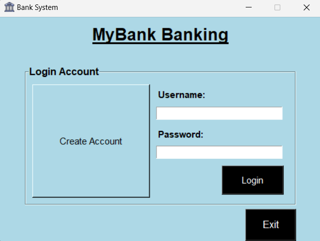

# 🚀 Project Name: MyBANK Banking Application

## 📚 Overview
The **MyBANK Banking Application** is an intuitive and user-friendly banking system developed to simplify financial transactions. This application empowers users to effortlessly manage their finances with features that include account creation, secure login, and seamless money deposits and withdrawals. Built with the powerful combination of Python, SQLite for robust database management, and Tkinter for an engaging graphical user interface, MyBANK offers a reliable and efficient banking experience.

## 📋 Features
- **User Registration:** Allows new users to create an account.
- **User Login:** Existing users can log in to their accounts.
- **Deposit Funds:** Users can deposit money into their accounts.
- **Withdraw Funds:** Users can withdraw money from their accounts.

## 📂 Project Structure
- `main.py`: The main application script and manages the graphical user interface using Tkinter.
- `function.py`: Handles database connections and queries using SQLite.

## 🖼️ Screenshot
<p>
  &nbsp;&nbsp;&nbsp;&nbsp;&nbsp;&nbsp;&nbsp;&nbsp;&nbsp;&nbsp;
  
</p>

*Brief Information: The screenshot above shows the main interface of the MyBANK Banking Application. Users can easily navigate through options to register, log in, deposit, and withdraw funds.*

## 🚀 Getting Started

### Prerequisites
Ensure you have Python installed on your system. If not, you can download and install it from [python.org](https://www.python.org/downloads/).

### Installation
1. Clone the repository:
    ```bash
    git clone https://github.com/Kheav-Kienghok/Bank-System-Application
    ```

## 💻 Usage
After finishing the installation step, to use this application, run the following command:
```bash
python main.py
```
Or run main.py file directly from your IDE.

## 📜 License
This project is licensed under the MIT License. See the LICENSE file for more details.

## 🙌 Contributing
Contributions are welcome! Please fork this repository and submit a pull request for any enhancements or bug fixes.
